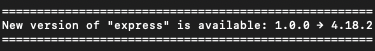

# Update notifier GO 


Unlike `update-notifier` this
- Won't download several dependencies and be of any security risk of any dependency chains
- Won't depend on any core NodeJS modules. (so works in other env. too)
- Won't pollute your file system with json config files stores.
- It Will use the fetch api instead. (it will just be silent, if not available)

⚠️ Note: Personally I wouldn't use anything like a update checker but i keep
seeing other ppl wishes to have this kind of things. I personally thought
`update-notifier` polluted my hard drive with config files and having access to
the file system, and it never cleaned up after itself which i didn't like.
Instead i would just run: `npm deprecate express@1.0.0 <MESSAGE>`

## Install

`update-notifier-go` is an ESM-only module - you are not able to import it with `require`. If you are unable to use ESM in your project you can use the async `import('update-notifier-go')` from CommonJS to load `update-notifier-go` asynchronously.<br>
`npm install update-notifier-go`

## Use

```js
import { updateNotifier } from 'update-notifier-go'
updateNotifier('express', '2.1.1')
```


